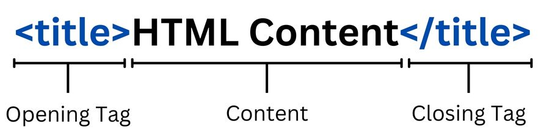

# HTML - HyperText Markup Language

## Content
1. [What is HTML?](#what-is-html)
2. [HTML Element](#html-element)
3. [HTML Document](#html-document)
4. [Essential HTML Element](#essential-html-element)

## What is HTML? 

HTML(HyperText Markup Languaye) is used to create the structure of web content.

 ## 3 Basic of Web Content:

 1. HTML - Structure
 2. CSS - Styles (Color/Typography)
 3. JavaScript - Motion/Events/Action

## HTML element

### Anatomy of an HTML Element



Elements can have attributes:
```HTML
<h1 id="header01" style="color: blue;">This is the header</h1>
```
`id` and `style` are attributes of `h1` element.

### Nested element
Elements can also inside the elements:

```HTML
<p><strong>Lorem Ipsum</strong> is simply dummy text of the printing and typesetting industry.</p>
```
**Output:**

<pre><p><strong>Lorem Ipsum</strong> is simply dummy text of the printing and typesetting industry.</p></pre>

### Void element

Void element is an element that does not have closing tag.
e.g.
```HTML 
<hr/>
```

**Output:**
<pre><hr/></pre>

## HTML Document

Example HTML document
```HTML
<!DOCTYPE html>
<html>
    <head>
        <title>First Page</title>
    </head>
    <body>
        <h1>First Page</h1>
    </body>
</html>
```

## Essential HTML Element 


## References
